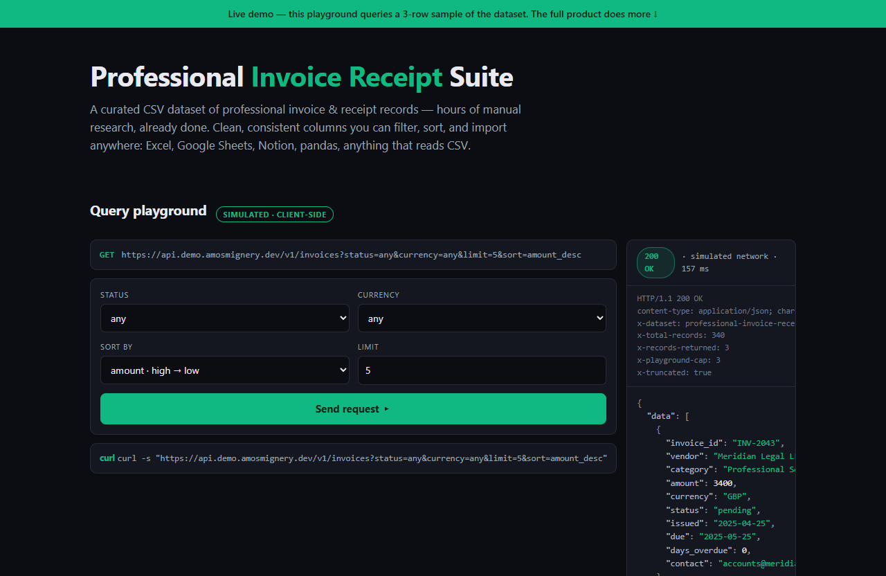

# Professional Invoice Receipt Suite — live demo

  

  <a href="https://amos-mig.github.io/professional-invoice-receipt-suite-demo/"><strong>▶ Open the live demo</strong></a> ·
  <a href="https://amosmign.gumroad.com/l/professional-invoice-receipt-suite"><strong>Get the full product · €7</strong></a>

## What this is

An interactive API-style query playground that simulates querying the Professional Invoice Receipt Suite dataset — filter a 12-record sample by status, currency, sort and limit with realistic status codes, headers, latency and JSON responses computed from your input. A 3-row playground cap and locked feature cards tease the full 340-record CSV export.

**Try it:** Set Status to overdue, hit Send request, then push the Limit past 3 to hit the playground cap — that's the moment you'll want the full CSV.

## What you get in the full product

- Research done for you — save hours of manual collection
- Clean, consistent structure: sort, filter, and import anywhere
- Works in Excel, Google Sheets, Notion, and any CSV-compatible tool
- Practical fields chosen for real decision-making

## About

- **Storefront:** [kits.amosmignery.dev](https://kits.amosmignery.dev) — single-file products, instant download, commercial license
- **Checkout:** [Gumroad](https://amosmign.gumroad.com/l/professional-invoice-receipt-suite) (Merchant of Record, VAT handled)
- **Full product:** [Professional Invoice Receipt Suite](https://amosmign.gumroad.com/l/professional-invoice-receipt-suite) · €7

## License

The demo page in this repo is MIT-licensed — reuse the technique, not the product.
The **Professional Invoice Receipt Suite** itself is not included here and is not free software.
